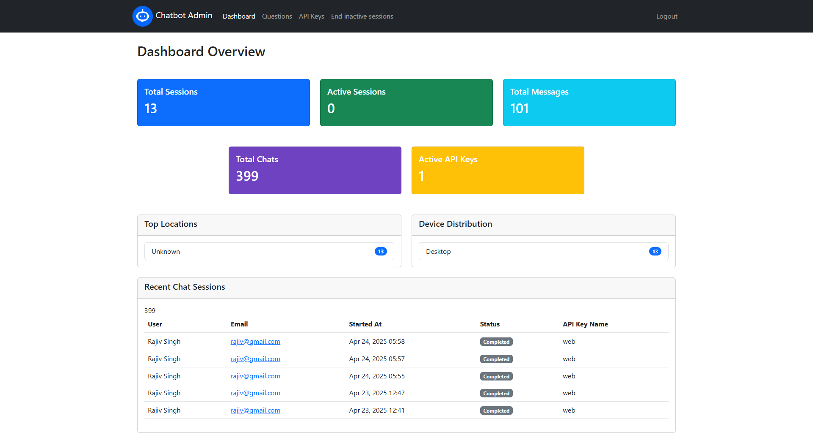
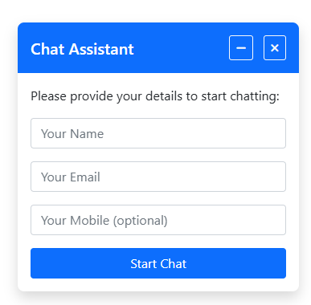
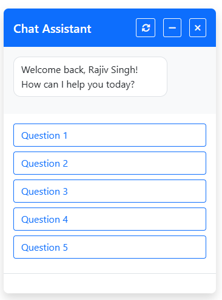
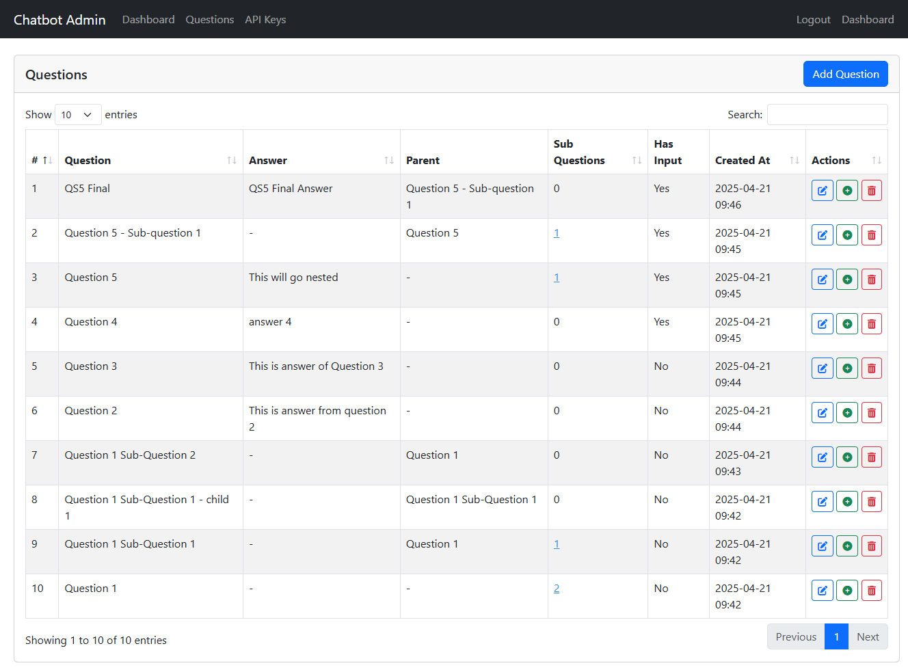
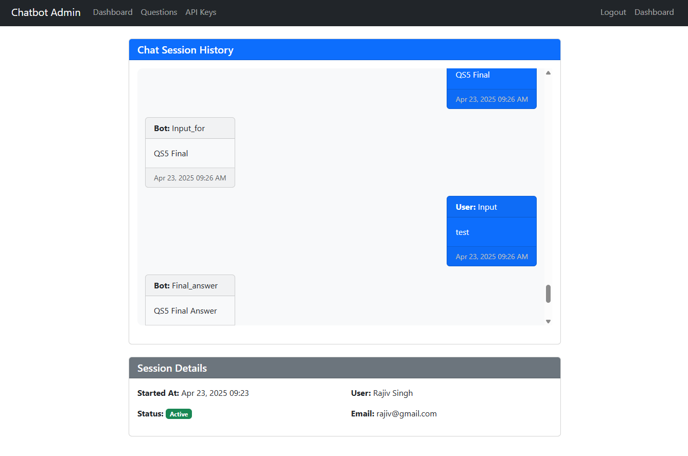

<h1 align="center">🤖 Laravel Chatbot System</h1>

<p align="center">
  
</p>

---

## ✨ Features

### 👥 User Features
- 🗨️ **Interactive chat widget**
- 📝 **Pre-chat registration**
- 🌐 **Question/answer flow**
- 🔄 **Session persistence**
- 📱 **Mobile responsive**

### 🛠️ Admin Features
- 👁️ **View all chat sessions**
- 🔍 **Search and filter conversations**
- 📊 **Detailed chat histories**
- ⏱️ **Session duration tracking**
- 🔑 **API key management**

---

## ⚙️ Installation

### 📋 Requirements
- PHP 8.0+
- MySQL 5.7+
- Composer 2.0+
- Node.js 14+

### 🚀 Setup Steps

```bash
git clone https://github.com/yourusername/laravel-chatbot.git
cd laravel-chatbot
composer install
npm install
cp .env.example .env
php artisan key:generate
```

#### 🛠️ Configure Database
Edit `.env`:

```env
DB_CONNECTION=mysql
DB_HOST=127.0.0.1
DB_PORT=3306
DB_DATABASE=laravel_chatbot
DB_USERNAME=root
DB_PASSWORD=
```

#### 🧱 Run Migrations and Build Assets

```bash
php artisan migrate --seed
npm run build
php artisan serve
```

---

## 💬 Usage

### 🧩 Embedding the Chatbot
Add this to your website:

```html
<div id="chatbot-container" data-key="YOUR_API_KEY"></div>
<script src="/chatbot.js"></script>
```

### 🔐 Admin Access
- Admin panel: `/admin`
- **Default credentials**:
  - 📧 Email: `admin@example.com`
  - 🔐 Password: `password`

---

## 🖼️ Screenshots

| Feature | Preview |
|--------|---------|
| **User Registration** |  |
| **Chat Interface** |  |
| **Admin Dashboard** |  |
| **Question Management** |  |
| **Chat History** |  |

---

## 📄 License

MIT

---

## 📬 Contact Developer

If you have any questions, suggestions, or need support, feel free to reach out:

- 🧑‍💻 **Tulsiram Kushwah**
- 📧 Email: [ramp00786@gmail.com](mailto:ramp00786@gmail.com)
- 🌐 GitHub: [github.com/ramp00786](https://github.com/ramp00786)